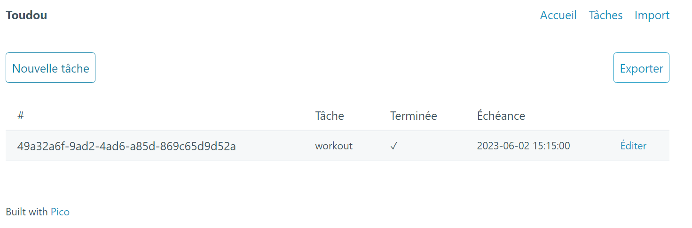

# Todo List Flask app



## Introduction
Welcome to **Toudou**, a simple yet powerful **todo list web application**! Toudou is a school project that required the creation of a **CRUD** (Create, Read, Update, Delete) application for managing todos. This project is built using several popular **Python libraries** including Click, SQLAlchemy, Flask, and Jinja, and it also utilizes error handlers, WTForms, logging, and flask-httpauth to provide a **robust** and **reliable** experience for users.
With Toudou, you can **easily** manage your daily tasks and keep track of your progress towards achieving your goals. The intuitive user interface allows you to create, update, and delete todos, as well as view your todos by priority or due date. Additionally, the application provides user authentication and authorization to ensure that your todos remain secure.

## Features
Toudou provides a range of features to help you manage your todos:

**Create**: You can easily create new todos by entering a task, due date, and state (task complete or not).

**Read**: You can view all of your todos on the home page, and filter them by priority or due date. Additionally, you can view individual todos on their own page to see more details about the task.

**Update**: You can update existing todos by editing their task, due date, state, or priority level.

**Delete**: You can delete todos that are no longer needed.

**Import**: You can import a CSV file of todos to add multiple tasks at once.

**Export**: You can export all of your todos to a CSV file, which can be opened in a spreadsheet program like Excel.

Toudou's user interface is designed to be intuitive and easy to use, allowing you to quickly manage your todos and stay organized. Whether you're working on a school project, planning your daily tasks, or managing a team, Toudou has the features you need to get things done.
## Installation

**1. Add** flask to pdm :
```bash
$ python -m pdm add flask
```
**2. Initialize** a new database :
```bash
$ python -m pdm run toudou init-db
```

## Usage


**Web Interface**

To use the application through the web interface:
1. Start the server: 
```bash
$ python -m pdm run flask --app src/toudou/views.py --debug run
```
2. Open a web browser and go to http://localhost:5000/ to view the to-do list.

**Command Line Interface**

To use the application through the CLI, run the following commands:
- Create a new task:
```bash
python -m pdm run toudou create
```
- Get a task by its id: 
```bash
python -m pdm run toudou get –id <id>
```
- Get all tasks: 
```bash
python -m pdm run toudou get_all
```
- Import tasks from a CSV file: 
```bash
python -m pdm run toudou import_csv <csv_file>
```
- Update a task: 
```bash
python -m pdm run toudou updating –id <id> --task=<task> --complete <complete> --due <due>
```
- Delete a task:
```bash
python -m pdm run toudou remove –id <id>
```


**Notes**

- \<id> is the unique identifier of the task.
- \<task> is the description of the task.
- \<complete> is a boolean value indicating whether the task is complete or not.
- \<due> is the due date of the task in the format DD/MM/YY.

## Thanks
